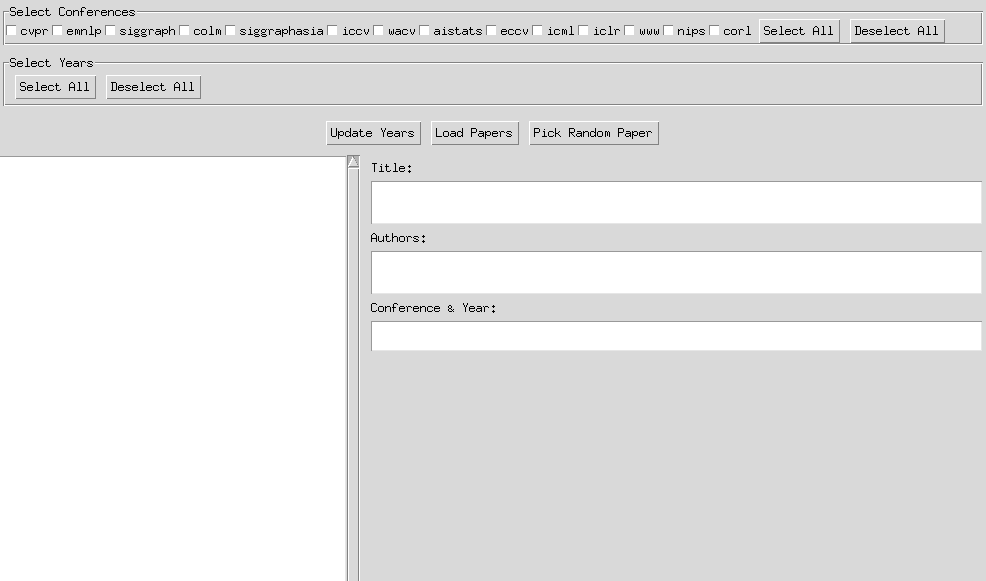

# Random-ML-Paper-Picker
A simple Python application for randomly selecting research papers from multiple top-tier machine learning conferences.  
Users can filter papers by conference & year, and pick a random paper that meets their criteria.

# Prerequisites
1. Download the **paperlist** from: [PaperCopilot Paperlists](https://github.com/papercopilot/paperlists).
2. Extract it into the `paperlist` directory inside the project folder.

# Run
```shell
python main.py
```
1. Check conferences.
2. Select years.
3. Pick random paper.
